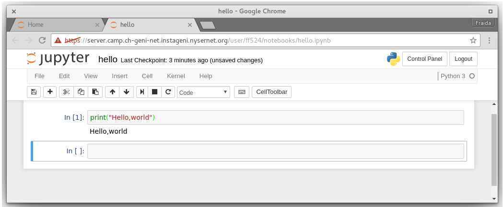

# "Hello, world" of Python

If you need help at any time, put your **red** sticky note on the back of your 
laptop. When you've finished the steps on all of these pages, put the 
**green** sticky note on the back of your laptop. 

## Using a Python shell

One way to use Python is by typing code into the Python interpreter interactively.
To open a Python shell on our server, type

```
python
```

in the Bash shell. You should see your prompt change to `>>>`, like this:

```
Python 2.7.6 (default, Jun 22 2015, 17:58:13) 
[GCC 4.8.2] on linux2
Type "help", "copyright", "credits" or "license" for more information.
>>> 
```

indicating that you're now in a Python shell. In the Python shell, type

```
print("Hello, world")
```

and hit \keys{Enter}. Then, to close your Python shell, either use \keys{Ctrl+D},
or type `quit()` and hit \keys{Enter}.

There are two widely used "major" versions of Python: Python 2 and Python 3.
The shell we were given when we typed `python` without specifying a version 
was a Python 2 shell. To open a Python 3 shell, type

```
python3
```

at the Bash shell prompt, and note the different version number:

```
Python 3.4.3 (default, Sep 14 2016, 12:36:27) 
[GCC 4.8.4] on linux
Type "help", "copyright", "credits" or "license" for more information.
>>> 
```
You can close the Python 3 shell in the same way: with \keys{Ctrl+D} or `quit()`.

One difference between Python 2 and Python 3 that can be confusing is the 
`print` syntax. 

Open a `python2` shell and verify to yourself that in Python 2, we can use
either of these to print a message:

```
print("Hello, world")
print "Hello, world"
```

Now, close your `python2` shell and open a `python3` shell. 
In Python 3, only the first way is valid:

```
print("Hello, world")
```

but when you try running

```
print "Hello, world"
```

in Python 3, you will get the error message

```
SyntaxError: Missing parentheses in call to 'print'
```

\pagebreak

## Writing a Python script

We can also put Python code in a file, and execute it as a script.
In the Bash shell, create a file called `hello.py`:

```
nano hello.py
```

and put

```
print("Hello,world")
```

in it. Then use \keys{Ctrl + O} to write it to file, hit \keys{Enter} 
to confirm the file name to which to save, and use \keys{Ctrl + X} to exit `nano`.

Now you can execute the script from the Bash shell with 

```
python hello.py
```      
(using either a relative path or absolute path to `hello.py`).

To specifically run our script with Python 2 or Python 3 (rather than accepting
whatever the system default is), we can use

```
python2 hello.py
```

or 

```
python3 hello.py
```

As we've learned previously, if we want to be able to execute a 
script without having to specify the interpreter with which to execute it, we 
need to

* add a _shebang_ at the top of the file specifying which interpreter to use 
to run it, and
* make the script executable.

Open your `hello.py` file with nano again, and add the shebang to the top:

```
#!/usr/bin/env python
```

Save the file and close `nano`, then make the file executable with

```
chmod a+x hello.py
```

Now you can run it with

```
./hello.py
```

or by typing the full path to `hello.py` in your Bash shell.

To explicitly specify whether you want to run your script with Python 2 or
Python 3, you can change the shebang to 

```
!#/usr/bin/env python2
```

or 

```
#!/usr/bin/env python3
```

respectively.

\pagebreak

## Using a Python notebook 

Another popular way to use Python is with a Python notebook. A notebook 
lets you write Python code, execute it, and see the results (text output or 
images), all from a web browser. We have set up a Python notebook server that
you can access for the duration of this workshop.

Open a browser. (Chrome is recommended; some students have had problems 
trying to use our notebook server with Safari.) In the browser, visit the URL: 
https://server.camp.ch-geni-net.instageni.nysernet.org/

You may have to tell your browser to add an exception to allow access to this 
site, even though it uses an untrusted certificate. When you reach the login
screen, log in with your net ID and the password that was distributed 
last week. 

When you log in, you will be "located" in your home directory. 
To start a new Python 3 notebook there, choose \menu{New > Python 3}. 
At the top of the page in your new notebook, click on where it says "Untitled"
and change the notebook name to "hello".

Then in the first "cell" of the notebook, type

```
print("Hello, world")
```
and click the \menu{\ForwardToEnd} button or \menu{Cell > Run Cells} 
to run the code in that cell.


